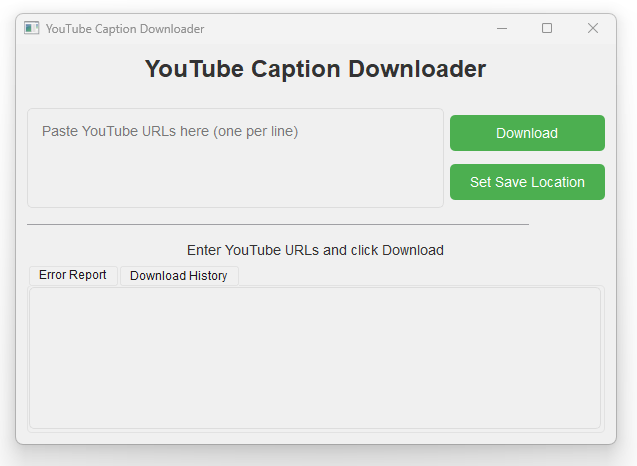

# YouTube Caption Downloader

YouTube Caption Downloader is a user-friendly desktop application that allows you to easily download and save captions (subtitles) from YouTube videos. Built with Python and PyQt6, this tool provides a simple and efficient way to access text content from YouTube videos for various purposes such as content analysis, transcription, or language learning.

## Key Features

- **Batch Processing**: Download captions from multiple YouTube videos simultaneously by entering multiple URLs.
- **Custom Save Location**: Choose where you want to save the downloaded caption files.
- **Video Title Detection**: Automatically uses the YouTube video title as part of the filename for easy organization.
- **Download History**: Keeps track of previously downloaded videos to avoid duplicates.
- **Error Reporting**: Provides clear error messages for any issues encountered during the download process.
- **User-Friendly Interface**: Clean and intuitive GUI for easy navigation and use.

## Installation

### Prerequisites

- Python 3.6 or higher
- pip (Python package installer)

### Steps

1. **Clone the repository**

   ```
   git clone https://github.com/yourusername/youtube-caption-downloader.git
   cd youtube-caption-downloader
   ```

2. **Set up a virtual environment (optional but recommended)**

   On Windows:
   ```
   python -m venv venv
   venv\Scripts\activate
   ```

   On macOS and Linux:
   ```
   python3 -m venv venv
   source venv/bin/activate
   ```

3. **Install required packages**

   ```
   pip install -r requirements.txt
   ```

## Usage

### Running from Source

1. Navigate to the project directory.
2. Activate the virtual environment if you're using one.
3. Run the application:

   ```
   python youtube-transcriber-app.py
   ```

### Creating and Using an Executable

1. Install PyInstaller:

   ```
   pip install pyinstaller
   ```

2. Create the executable:

   ```
   pyinstaller --onefile --windowed youtube-transcriber-app.py
   ```

3. Find the executable in the `dist` folder.
4. Double-click the executable to run the application.

## How to Use

1. Launch the application.
2. Enter one or more YouTube video URLs in the text area, one per line.
3. (Optional) Click "Set Save Location" to choose where the caption files will be saved.
4. Click "Download" to start the caption download process.
5. Monitor the progress bar for download status.
6. Check the "Error Report" tab for any issues encountered during the download.
7. View the "Download History" tab to see previously processed videos.

## Contributing

Contributions to improve YouTube Caption Downloader are welcome! Please feel free to submit a Pull Request.

## License

This project is licensed under the MIT License - see the [LICENSE](LICENSE) file for details.

## Acknowledgments

- [youtube_transcript_api](https://github.com/jdepoix/youtube-transcript-api) for providing access to YouTube captions.
- [yt-dlp](https://github.com/yt-dlp/yt-dlp) for robust YouTube data extraction.
- [PyQt6](https://www.riverbankcomputing.com/software/pyqt/) for the graphical user interface.

## Support

If you encounter any problems or have any suggestions, please open an issue on the GitHub repository.

Enjoy using YouTube Caption Downloader!
